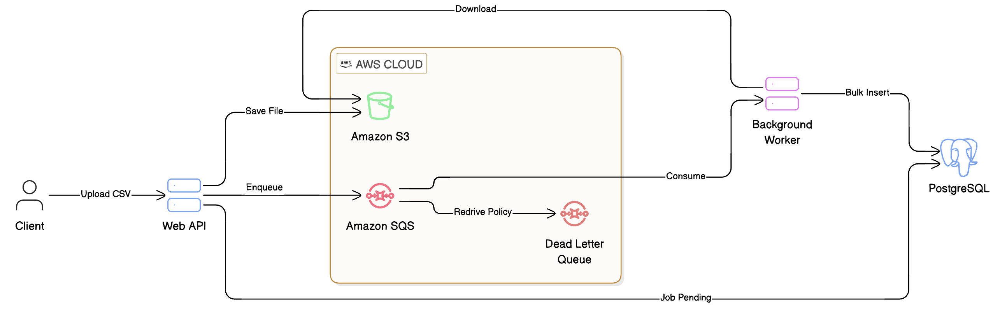

# Distributed File Processor

A robust, event-driven distributed system built with **C# 14** and **.NET 10** for processing large files asynchronously. This project serves as an engineering sandbox to explore cloud-native patterns, specifically integrating **AWS S3**, **AWS SQS**, and Background Workers to handle mass data ingestion reliably.

## Table of Contents

- [Prerequisites](#prerequisites)
- [How to Run](#how-to-run)
- [Project Structure](#project-structure)
- [Architecture & Design Principles](#architecture--design-principles)

## Prerequisites

Ensure you have the following installed to run this project efficiently:

- **[.NET 10 SDK](https://dotnet.microsoft.com/en-us/download/dotnet/10.0)** (or later)
- **[Docker Desktop](https://www.docker.com/)** (Required to orchestrate PostgreSQL, Seq, and LocalStack)
- **IDE:** [Visual Studio](https://visualstudio.microsoft.com), [Visual Studio Code](https://code.visualstudio.com/), or [Rider](https://www.jetbrains.com/rider/).

## How to Run

### 1. Clone the Repository

```bash
git clone https://github.com/kauatwn/dotnet-sqs-s3-file-processor.git
```

### 2. Enter the Directory

```bash
cd dotnet-sqs-s3-file-processor
```

### 3. Run with Docker Compose

This command spins up the API, the Background Worker, PostgreSQL, Seq (for centralized logging), and **LocalStack** (simulating AWS S3 and SQS locally).

```bash
docker compose up -d
```

_The API Swagger UI will be accessible at `http://localhost:8080/swagger`. Seq (Logs) will be accessible at `http://localhost:5341`._

### 4. Execute Tests

To validate the domain logic, infrastructure parsing, and distributed flows:

```bash
dotnet test
```

## Project Structure

The solution follows the **Clean Architecture** principles to ensure separation of concerns, with a dedicated split between the Web API and the Background Worker.

```plaintext
dotnet-sqs-s3-file-processor/
├── src/
│   ├── DistributedFileProcessor.API/             # Entry point, Controllers, File Upload
│   ├── DistributedFileProcessor.Worker/          # Background Service (SQS Consumer)
│   ├── DistributedFileProcessor.Application/     # Use Cases, DTOs, Business Flow
│   ├── DistributedFileProcessor.Domain/          # Entities, Enums, Interfaces
│   └── DistributedFileProcessor.Infrastructure/  # S3, SQS, EF Core, CSV Parsing
└── tests/
    ├── DistributedFileProcessor.UnitTests/       # Fast, isolated tests (Use Cases & Parsers)
    └── DistributedFileProcessor.IntegrationTests/# Full stack tests (Testcontainers + LocalStack)
```

## Architecture & Design Principles

This repository prioritizes **scalability** and **asynchronous processing**, following strict development guidelines for distributed systems.

### 1. Event-Driven Architecture

To prevent the main Web API from blocking during large file processing (e.g., 100MB CSV files with millions of rows), the system offloads the heavy lifting to a background worker.


_Figure 1: Event-driven flow from file upload to database ingestion._

1. **Upload (API):** The user uploads a CSV file via the API.
2. **Storage:** The API uploads the raw file to an **Amazon S3** bucket (Streaming approach to avoid RAM exhaustion).
3. **Tracking:** A job record with a "Pending" status is saved to the PostgreSQL database.
4. **Messaging:** An event containing the Job ID is published to an **Amazon SQS** queue.
5. **Processing (Worker):** A background worker listens to the SQS queue, downloads the file from S3, streams and parses the CSV content (`IAsyncEnumerable`), and performs a bulk insert of the records into the database.

### 2. Design Patterns

The project utilizes established patterns to ensure modularity and cloud readiness.

|             Pattern              |                 Usage Scenario                  | Implementation                  |
| :------------------------------: | :---------------------------------------------: | :------------------------------ |
|        **Thin Wrappers**         |     Isolating AWS SDK calls for S3 and SQS      | `S3FileStorageService`          |
| **Streaming (IAsyncEnumerable)** | Processing large datasets without memory limits | `CsvTransactionFileParser`      |
|          **Use Cases**           |      Encapsulating distinct business flows      | `UploadDocumentUseCase`         |
|     **Dependency Injection**     |      Decoupling layers and cloud services       | `IServiceCollection` extensions |

### 3. Resilience & Error Handling

Distributed systems are prone to network failures. The application handles this through:

- **Polly Resilience Pipelines:** Configured for S3 and SQS interactions to handle transient network errors.
- **Dead Letter Queues (DLQ):** If the worker fails to process a file (e.g., bad CSV format) after multiple retries, the message is routed to an SQS DLQ, and the job status is marked as "Failed".

### 4. Known Limitations & Trade-offs

This project is an engineering sandbox focused on the integration between .NET, S3, and SQS.

> [!WARNING]
> **Trade-off: The Dual-Write Problem & The Outbox Pattern**
>
> In the `UploadDocumentUseCase`, the system saves the job state to the PostgreSQL database and immediately publishes a message to SQS.
>
> This is a classic **Dual-Write** scenario. If the database transaction commits successfully, but the network call to AWS SQS fails, the system is left in an inconsistent state (a job stuck in "Pending" forever).
>
> **Production Considerations:** In a mission-critical production environment, this issue should be mitigated using the **Transactional Outbox Pattern**. Instead of publishing directly to SQS, the API would write the SQS message payload into an "Outbox" table within the _same database transaction_ as the job record. A separate background publisher (or CDC tool like Debezium) would then reliably poll the outbox table and guarantee At-Least-Once delivery to SQS.

### 5. Comprehensive Testing Strategy

The project adopts a strategy focused on **Cloud Integration** and **Isolation**.

- **Unit Tests:** Verify business rules and CSV parsing logic in isolation.
- **Integration Tests:** Verify the entire distributed pipeline.
  - **Technology:** Uses **Testcontainers** to orchestrate real instances of PostgreSQL and **LocalStack**.
  - **Worker Validation:** The test suite injects the Worker into the `WebApplicationFactory`, allowing end-to-end validation (API -> DB -> S3 -> SQS -> Worker -> DB) within a single test execution.

### 6. CI/CD & Quality

The project includes a **GitHub Actions** workflow that ensures quality on every push:

- **Automated Testing:** Runs Unit and Integration tests using `XPlat Code Coverage`.
- **Static Analysis:** Integrates with **SonarCloud** for code quality gates, explicitly excluding EF Core migrations and AWS wrappers via `[ExcludeFromCodeCoverage]`.
- **Docker Build Validation:** Verifies that both API and Worker container images build successfully (`docker buildx`).
